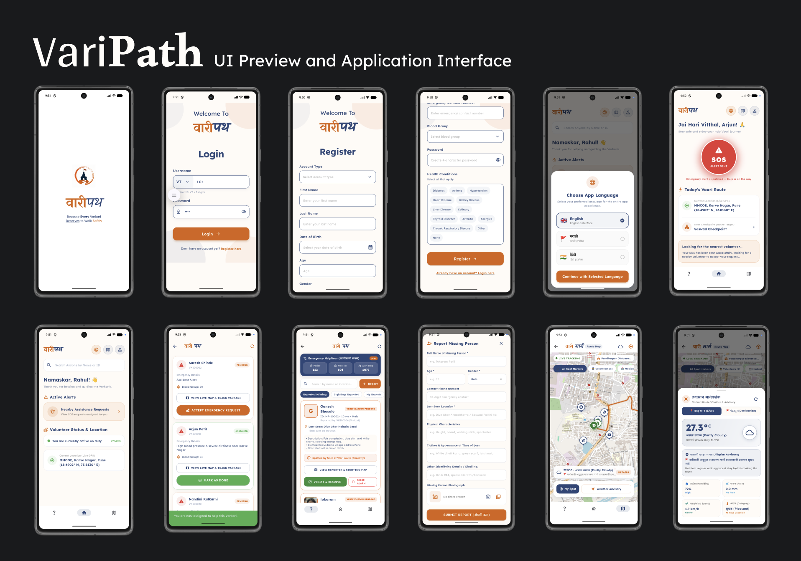
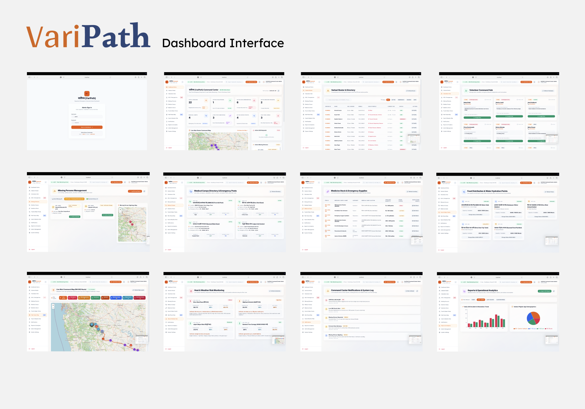

# वारीपथ (VariPath)

**Because every Varkari deserves to walk safely.**

VariPath is a safety and emergency-response platform designed specifically for the Wari pilgrimage. It combines a smartphone application with a toll-free IVR system, enabling Varkaris, volunteers, medical staff, organisers, and families to stay connected during the pilgrimage.

The platform focuses on emergency response, digital health information, missing-person tracking, medical camp coordination, weather-risk awareness, and volunteer deployment — while ensuring that even pilgrims without smartphones can access the safety network.

## Problem Statement

Every year, 2–3 lakh Varkaris walk hundreds of kilometres during the Wari pilgrimage. However, emergency response and health management systems supporting them can remain fragmented, manual, and reactive.

This creates several critical challenges:

- No instant access to a pilgrim's health information during emergencies
- Unstructured missing-person reporting and tracking
- Lack of real-time visibility into medical camp medicine stocks
- Digital exclusion of elderly and low-income Varkaris using basic keypad phones
- Limited communication of weather and heat-related risks
- Manual and inefficient volunteer deployment

VariPath addresses these challenges through a unified digital safety platform.

## Proposed Solution

VariPath is a two-layer safety platform:

1. **VariPath Mobile Application** – for pilgrims and volunteers using smartphones
2. **Sparsh-Alert IVR System** – for pilgrims using basic keypad phones

Both systems connect to a centralized organiser dashboard, creating a unified safety network across the Wari route.

## Features

### 1. Digital Health Card

- Digital pilgrim profile containing important health information
- Blood group, medical conditions, medications, and emergency contact details
- Unique Pilgrim ID
- QR-based identification
- Health information can be accessed by authorised volunteers during emergencies

### 2. SOS & Emergency Response

- One-tap emergency SOS
- Shares the pilgrim's live GPS location
- Provides access to the pilgrim's digital health information
- Alerts nearby volunteers and medical camps
- Automatic escalation if an alert remains unresponded for 3 minutes

### 3. Missing Person Tracker

- Report a missing pilgrim
- Upload the person's photograph
- Record the last-known location
- Broadcast alerts to volunteers in the relevant zone
- Notify the family through SMS when the person is found

### 4. Medicine & Medical Camp Tracker

- Displays medical camps along the Wari route
- Tracks medicine availability
- Provides real-time stock visibility
- Alerts organisers when critical medicines are running low
- Helps coordinate restocking between camps

### 5. Weather & Heat Risk Advisory

- Route-based weather monitoring
- Colour-coded heat-risk zones
- Green / Yellow / Red risk indicators
- Heatstroke and dehydration awareness
- Suggestions for nearby hydration points

### 6. Sparsh-Alert — IVR for Non-Smartphone Users

Sparsh-Alert extends the VariPath safety network to pilgrims who do not own smartphones.

A pilgrim can give a missed call to the toll-free number:

**080-47283047**

The system calls back and provides a Marathi voice menu. The pilgrim can interact using keypad inputs or voice.

The resulting request is categorised into:

- Medical
- Missing Person
- Weather
- Other

The alert is then displayed on the organiser dashboard and can be forwarded to the nearest available volunteer.

## How It Works

### Smartphone Users

1. Varkari registers through the VariPath application
2. Personal and emergency health information is stored
3. A unique Pilgrim ID and QR code are generated
4. The pilgrim can access safety features throughout the Wari
5. In an emergency, the pilgrim can trigger an SOS
6. Nearby volunteers and medical camps receive the alert
7. The pilgrim's location and relevant health information can be accessed by authorised responders

### Basic Phone Users

1. Pilgrim gives a missed call to the Sparsh-Alert number
2. The IVR system calls the pilgrim back
3. Marathi voice instructions are provided
4. The pilgrim selects or speaks their requirement
5. The request is categorised automatically
6. The alert reaches the organiser dashboard
7. The nearest volunteer can respond

## Technology Stack

| Component | Technology |
|---|---|
| Mobile Application | Flutter, Dart |
| Backend | Python |
| Database | PostgreSQL |
| Maps | Google Maps API |
| Weather | OpenWeatherMap API |
| IVR & Calling | Exotel |
| Speech-to-Text | Sarvam AI / OpenAI Whisper |
| Notifications | Firebase FCM / Twilio SMS |
| Communication | REST APIs |

## Innovation

- IVR-based safety access for pilgrims without smartphones
- Digital health profile without dependency on physical hardware
- QR-based pilgrim identification
- Proactive weather and heat-risk alerts
- Real-time medical camp medicine monitoring
- Unified safety system for pilgrims, volunteers, medical staff, organisers, and families
- Combination of smartphone and IVR technologies for wider accessibility

## Feasibility

- Uses production-ready technologies and APIs
- Modular architecture allows phased deployment
- Can initially be tested on a single Palkhi route
- Can integrate with existing Wari registration infrastructure
- Marathi speech processing can be supported through Sarvam AI
- The system can be scaled as the number of pilgrims and camps increases

## Expected Impact

### Varkaris
- Faster emergency response
- Access to digital health information
- Weather and heat-risk awareness
- Improved safety during the pilgrimage

### Elderly & Non-Smartphone Users
- Access to emergency services without requiring a smartphone
- Marathi voice-based interaction
- Basic-phone compatibility through Sparsh-Alert

### Volunteers
- Faster access to emergency alerts
- Location-based assistance
- Relevant pilgrim information during emergencies
- Better coordination across different zones

### Medical Staff
- Faster access to important pilgrim health information
- Real-time medicine stock visibility
- Improved coordination between medical camps

### Organisers
- Centralised monitoring
- Route-wide visibility
- Better volunteer coordination
- Real-time information about emergencies and medical camps

### Families
- SMS-based emergency and missing-person updates
- Faster communication during critical situations

## Feature Showcase

### VariPath Mobile Application

  
  

## Project Demo

Watch the VariPath application demonstration:

**YouTube:** https://youtu.be/lB4HScZlk8A

## Project Vision

VariPath aims to create a connected safety network for the Wari pilgrimage where emergency assistance, health information, missing-person coordination, medical resources, and weather alerts can be managed through a single platform.

**वारीपथ — Because every Varkari deserves to walk safely.**

## Author

**Amisha Mahajan**

**Aryan Patil**

**Pragati Trivedi**

**Anika Khadilkar**

**Shruti Jadhav**
